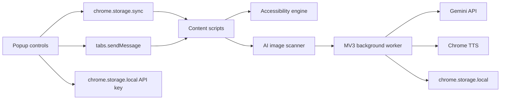

# System Architecture

## Overview

## Settings Flow

1. Popup reads global settings and site overrides.
2. Popup writes `auraSettings` and `auraSiteSettings`.
3. Content script reacts to storage changes and popup messages.
4. `aura-engine.js` applies root data attributes and CSS variables.

## AI Flow

1. User enables AI consent.
2. Content scanner finds candidate images.
3. Content sends `AURA_DESCRIBE_IMAGE` to background.
4. Background validates config, size, URL scheme, local/private host rules, rate limit.
5. Background builds task-specific request: caption, OCR, objects, or question.
6. Background sends image bytes to Gemini.
7. Background parses structured result.
8. Content applies returned description to `alt`, `aria-label`, and provenance data attributes.

## Data Stores

- `chrome.storage.sync`: user preferences and origin overrides.
- `chrome.storage.local`: AI cache and rate-limit timestamps.
- `chrome.storage.local`: optional user-provided Gemini API key.
- `src/config.js`: development API key, gitignored and excluded from package.

## Security Boundaries

- Content scripts do not call Gemini directly.
- Content scanner only selects visible public http/https images.
- Background rejects non-http, local, and private-network image URLs.
- AI is gated by popup consent setting.
