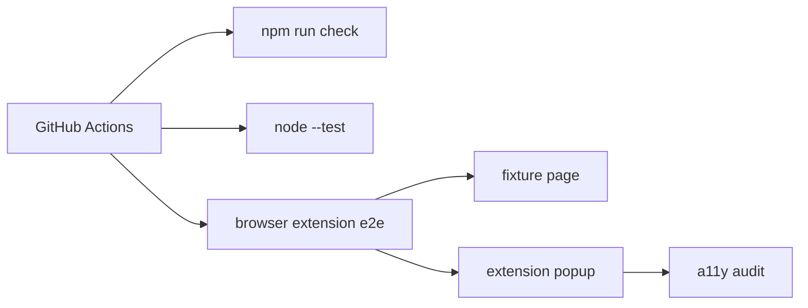

# Phase 01 - Validation and Quality Pipeline

## Context Links

- Parent: [plan.md](./plan.md)
- Research: [readiness report](../reports/260611-2140-aura-sota-2026-readiness-research.md)
- Current validation: [validation report](../../docs/validation-report.md)
- Code standards: [code standards](../../docs/code-standards.md)

## Overview

- Date: 2026-06-11
- Description: Add automated and manual validation evidence needed before claiming SOTA readiness.
- Priority: P0
- Implementation status: Completed
- Review status: Not reviewed

## Key Insights

- Current checks only cover syntax, manifest, settings, and URL guard.
- Research flags no browser runtime, no screen-reader pass, no popup a11y audit, no CI.
- Validation should be established before high-risk AI and permission changes.

## Requirements

- Add browser extension e2e smoke tests using Playwright or Puppeteer.
- Add popup accessibility audit using axe-core or equivalent.
- Add fixture HTML page with images, hidden images, private URLs, and controls.
- Add CI workflow for `npm run check`, `npm test`, and e2e where feasible.
- Add manual validation checklist for Chrome, Edge, keyboard-only, and screen reader.

## Architecture

## Related Code Files

- Modify: `package.json`
- Modify/create: `scripts/check-extension.mjs`
- Create: `.github/workflows/quality.yml`
- Create: `tests/e2e/*`
- Create: `tests/fixtures/*`
- Modify: `docs/validation-report.md`

## Implementation Steps

1. Pick Playwright unless repo constraints argue otherwise.
2. Add extension load smoke test for Chromium with local extension path.
3. Add popup render and keyboard navigation test.
4. Add fixture page test for visual settings and AI candidate filtering.
5. Add axe-core audit for popup HTML.
6. Add CI workflow and document local commands.
7. Update validation report with automated and manual matrix.

## Todo List

- [x] Add browser/runtime test scripts.
- [x] Add fixture page.
- [x] Add extension runtime contract smoke test.
- [x] Add popup static accessibility audit.
- [x] Add CI workflow.
- [x] Update validation docs.

## Success Criteria

- `npm run check`, `npm test`, and new e2e/a11y scripts pass locally.
- CI workflow exists and runs same checks.
- Validation report separates automated pass from manual pending/pass.

## Risk Assessment

- Browser automation may be flaky on Windows. Mitigate with fixed fixture pages and headless Chromium.
- Playwright adds dependency weight. Acceptable because SOTA claim requires real runtime evidence.

## Security Considerations

- Do not read `src/config.js`.
- AI tests must use mocks/stubs unless user explicitly provides live key.
- Fixture private URLs must not be fetched externally.

## Next Steps

- Phase 2 can use CI/a11y pipeline as guard for permission and privacy changes.

## Unresolved Questions

- Real browser extension automation is still future work; current e2e is runtime contract/static smoke.
