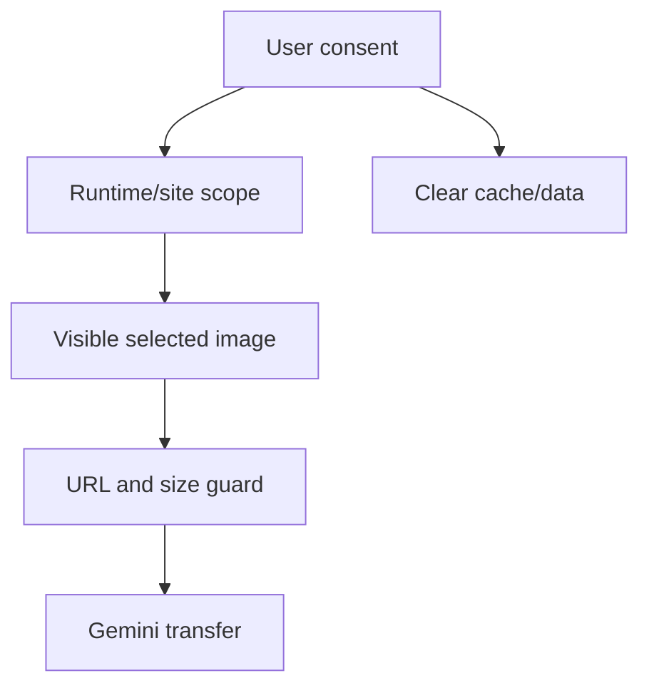

# Phase 02 - Permission Privacy Release Model

## Context Links

- Parent: [plan.md](./plan.md)
- Privacy doc: [privacy policy](../../docs/privacy-policy.md)
- Architecture: [system architecture](../../docs/system-architecture.md)
- Research: [readiness report](../reports/260611-2140-aura-sota-2026-readiness-research.md)

## Overview

- Date: 2026-06-11
- Description: Make permissions, AI data transfer, and key strategy defensible for production or Store review.
- Priority: P0
- Implementation status: Completed
- Review status: Not reviewed

## Key Insights

- `<all_urls>` is functional but high-friction for Store review.
- `src/config.js` is acceptable for local dev, not production distribution.
- Chrome policy expects disclosed, limited user data use.

## Requirements

- Re-audit `permissions`, `host_permissions`, and `content_scripts.matches`.
- Decide AI key strategy: user-provided key, backend proxy, or demo-only local key.
- Add user-facing privacy controls for cache/data deletion.
- Add Store disclosure draft and Limited Use statement.
- Add security threat model for AI image transfer.

## Architecture

## Related Code Files

- Modify: `manifest.json`
- Modify: `src/popup/popup.html`
- Modify: `src/popup/popup.js`
- Modify: `src/background/background.js`
- Modify: `docs/privacy-policy.md`
- Create: `docs/security-threat-model.md`
- Create: `docs/chrome-web-store-disclosure.md`

## Implementation Steps

1. Map each permission to exact code paths and user value.
2. Remove unused permissions or move feasible permissions to optional/runtime flow.
3. Decide and implement key model selected by user.
4. Add explicit privacy UI for AI transfer and cache deletion.
5. Document data lifecycle: collect, transfer, cache, delete.
6. Add tests for permission contract and privacy settings.
7. Update deployment guide and Store disclosure draft.

## Todo List

- [x] Permission audit table.
- [x] AI key model decision: user-provided local key plus dev-only `src/config.js`.
- [x] Runtime permission proposal or retained-permission justification.
- [x] Data deletion UX.
- [x] Threat model doc.
- [x] Store disclosure draft.

## Success Criteria

- Every manifest permission has a documented reason.
- AI can run in the selected production-safe key model.
- Privacy doc includes Limited Use language and data lifecycle.
- Tests prevent accidental permission creep.

## Risk Assessment

- Runtime optional permissions may complicate UX. Mitigate with clear onboarding and fallback messaging.
- Backend proxy changes project scope. Ask user before committing to it.

## Security Considerations

- Never ship a shared Gemini API key in extension source.
- Keep SSRF/private URL guards in background even if content filtering exists.
- Avoid logging image URLs or model payloads.

## Next Steps

- Phase 3 should build AI features only after key/transfer model is settled.

## Unresolved Questions

- Store-published or demo-only remains a product decision.
- Backend proxy remains out of scope until explicitly approved.
