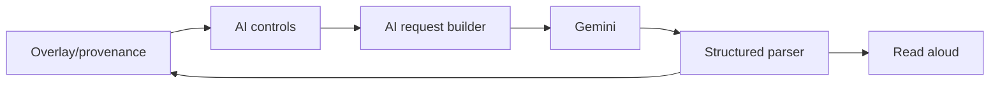

# Phase 03 - AI Assistive Capability Upgrade

## Context Links

- Parent: [plan.md](./plan.md)
- AI runtime: `src/content/aura-ai.js`, `src/background/background.js`
- Research: [readiness report](../reports/260611-2140-aura-sota-2026-readiness-research.md)

## Overview

- Date: 2026-06-11
- Description: Move from single-sentence captioning to controlled multimodal assistive workflow.
- Priority: P1
- Implementation status: Completed
- Review status: Not reviewed

## Key Insights

- Gemini supports captioning, VQA, classification, and object detection style tasks.
- Current implementation only returns one Vietnamese caption and overwrites `alt`.
- SOTA requires user control, structure, provenance, retry, and quality harness.

## Requirements

- Add selected-image workflow: describe only image user chose or confirmed.
- Add output modes: caption, OCR/text-in-image, objects, and question answer.
- Return structured JSON with fields: caption, detectedText, objects, cautions.
- Add provenance: generated by AURA AI, timestamp, cache state.
- Add retry and clear description actions.
- Add fixture-based quality tests with mocked Gemini responses.

## Architecture

## Related Code Files

- Modify: `src/content/aura-ai.js`
- Modify: `src/content/cs_ui.js`
- Modify: `src/background/background.js`
- Modify/create: `src/background/ai-request-builder.js`
- Modify/create: `src/background/ai-response-parser.js`
- Modify: `src/popup/popup.html`
- Modify: `src/popup/popup.js`
- Create: `tests/ai-response-parser.test.mjs`
- Create: `tests/fixtures/images/*` or lightweight fixtures

## Implementation Steps

1. Extract AI prompt/request builder from background into small module.
2. Add structured response schema and robust parser/fallback.
3. Add selected-image message path from content to popup/background.
4. Add modes for caption, OCR, objects, and question answer.
5. Add non-destructive page annotation with provenance instead of silent `alt` overwrite only.
6. Add TTS for selected result, not only first batch result.
7. Add mocked tests for parser, modes, consent, and blocked responses.

## Todo List

- [x] AI request builder module.
- [x] Structured parser module.
- [x] Selected-image control path.
- [x] OCR/object/question modes.
- [x] Provenance metadata.
- [x] Clear result/private-data actions.
- [x] Parser and request tests.

## Success Criteria

- User can pick an image and choose caption/OCR/objects/question mode.
- Model output is parsed and displayed consistently.
- Existing consent and URL guards remain active.
- Tests cover success, malformed response, blocked response, and cache path.

## Risk Assessment

- More AI modes can increase token/cost. Mitigate with explicit user action and cache.
- JSON output may fail. Mitigate with parser fallback and clear error messages.

## Security Considerations

- Keep identity-sensitive prompt constraints.
- Do not infer protected attributes or identity.
- Do not process hidden/private images.
- No live Gemini tests without explicit user-provided key.

## Next Steps

- Phase 4 turns AI capability into keyboard/screen-reader usable UX.

## Unresolved Questions

- OCR currently reads generated result after explicit popup action; revisit if auto-read is added.
