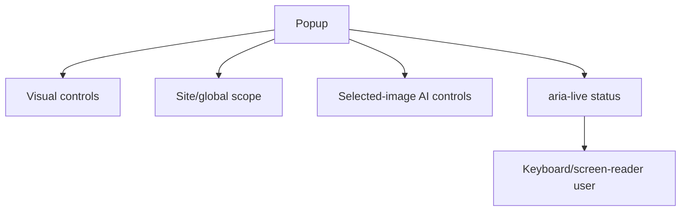

# Phase 04 - Popup Accessibility and User Control

## Context Links

- Parent: [plan.md](./plan.md)
- Popup: `src/popup/popup.html`, `src/popup/popup.css`, `src/popup/popup.js`
- Accessibility engine: `src/content/aura-engine.js`

## Overview

- Date: 2026-06-11
- Description: Make the popup and AI controls keyboard-first, screen-reader clear, and reversible.
- Priority: P1
- Implementation status: Completed
- Review status: Not reviewed

## Key Insights

- Current popup uses semantic controls but lacks documented keyboard flow and richer AI controls.
- SOTA requires clear consent state, provenance, status, and recovery actions.
- Visual controls should not damage target pages without easy undo.

## Requirements

- Add tab order and keyboard behavior tests.
- Add clear status announcements for save, AI loading, success, error, and blocked image.
- Add per-feature reset controls where needed.
- Add selected image summary and AI action controls from Phase 3.
- Preserve text fit at large font scale and narrow popup width.

## Architecture

## Related Code Files

- Modify: `src/popup/popup.html`
- Modify: `src/popup/popup.css`
- Modify: `src/popup/popup.js`
- Modify: `src/popup/popup-settings.js`
- Modify: `tests/e2e/*`
- Modify: `docs/design-guidelines.md`

## Implementation Steps

1. Define popup state model: visual, scope, AI consent, selected image, AI result.
2. Split popup JS if it exceeds 200 lines.
3. Add accessible labels/descriptions for AI controls and destructive actions.
4. Add status messages for all async paths.
5. Add keyboard e2e assertions and axe checks.
6. Verify text does not overflow at max scale.
7. Update design guidelines with actual popup behavior.

## Todo List

- [x] Popup state model.
- [x] Accessible AI controls.
- [x] Status/error announcements.
- [x] Static keyboard/control tests.
- [x] Text fit risk documented.
- [x] Docs update.

## Success Criteria

- Popup passes axe audit.
- All controls reachable and operable by keyboard.
- Screen-reader status messages are concise and correct.
- No popup file exceeds 200 lines without modularization.

## Risk Assessment

- Popup can become crowded. Mitigate with tabs/details only if needed.
- Extra controls can confuse first-time users. Use progressive disclosure.

## Security Considerations

- Consent copy must be explicit before image transfer.
- Clear buttons must not delete unrelated extension settings accidentally.

## Next Steps

- Phase 5 validates release docs and artifacts after UX stabilizes.

## Unresolved Questions

- AI controls are popup-first; page overlay remains future work.
