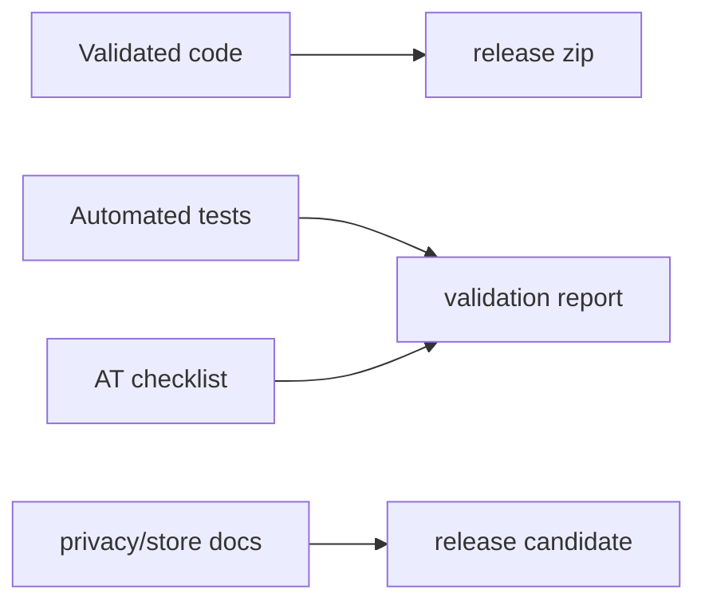

# Phase 05 - Release Documentation and Evidence

## Context Links

- Parent: [plan.md](./plan.md)
- Docs: `docs/`
- README: `README.md`
- Deployment: [deployment guide](../../docs/deployment-guide.md)

## Overview

- Date: 2026-06-11
- Description: Produce release package, validation evidence, and SOTA claim boundaries.
- Priority: P1
- Implementation status: In Progress
- Review status: Not reviewed

## Key Insights

- Research says current docs are good but not Store/evidence grade.
- SOTA claim must be bounded and backed by tests, manual checks, and privacy docs.
- Chrome Web Store needs disclosure and hosted privacy policy if publishing.

## Requirements

- Add package script for release zip excluding secrets and plans if desired.
- Add release checklist: version, icons, manifest, privacy, tests, manual AT.
- Update README with exact validated feature claims.
- Update docs: roadmap, changelog, architecture, deployment, privacy.
- Add manual validation artifacts for browser and screen reader.

## Architecture

## Related Code Files

- Modify: `package.json`
- Create: `scripts/package-extension.mjs`
- Modify: `README.md`
- Modify: `docs/validation-report.md`
- Modify: `docs/deployment-guide.md`
- Modify: `docs/project-changelog.md`
- Create: `docs/release-checklist.md`
- Create: `docs/manual-accessibility-validation.md`

## Implementation Steps

1. Define release scope: demo package or Store candidate.
2. Add package script that excludes `src/config.js`, `.git`, `plans`, and local-only files.
3. Update README claims to only validated capabilities.
4. Update privacy and Store disclosure based on Phase 2 decisions.
5. Add manual accessibility validation checklist and results template.
6. Run full test matrix and capture results in validation report.
7. Mark roadmap milestones complete or pending with evidence links.

## Todo List

- [ ] Release scope decision.
- [x] Package script.
- [x] Release checklist.
- [x] README claim update.
- [x] Manual validation docs.
- [x] Final validation report.
- [x] Changelog and roadmap update.

## Success Criteria

- `npm run package` creates a clean extension zip.
- Validation report includes automated and manual evidence.
- Docs do not overclaim SOTA beyond validated scope.
- Store disclosure draft is ready if publication is target.

## Risk Assessment

- Store submission may require policy changes outside code. Document blockers.
- Manual AT validation depends on available browser/screen-reader setup.

## Security Considerations

- Release package must exclude secrets.
- Privacy policy must match actual data flow.
- No hidden telemetry or undisclosed data transfer.

## Next Steps

- After this phase, run `/ck:code-review all codebase` and `/ck:ship` before any release.

## Unresolved Questions

- Who performs final screen-reader validation?
- Where will privacy policy be hosted if publishing?
